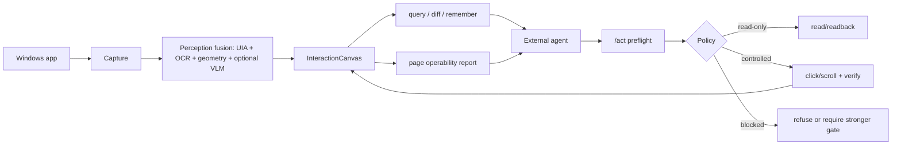

# OpenClaw

**OpenClaw is an agent-facing Windows desktop perception and guarded-action API.**

It turns a real desktop window into a structured `InteractionCanvas` that an AI agent can query, inspect, diff, remember, and act on through explicit safety policies.

OpenClaw is not a chatbot, not a browser-only automation wrapper, and not an app-specific workflow script. It is the missing middle layer between a general AI agent and messy native desktop software.

## Why It Exists

Desktop agents need more than screenshots. They need a stable map of the current app:

- What window is active?
- Which regions are navigation, content, toolbar, input, or dynamic message streams?
- Which controls are clickable, readable, risky, disabled, or ambiguous?
- What evidence supports each candidate?
- What changed after an action?

OpenClaw builds that map from UIA, OCR, geometric layout, memory, and optional VLM semantic supplements, then exposes it through local APIs.

## Features

- **Window observation**: enumerate Windows desktop apps and capture target windows.
- **InteractionCanvas**: normalized page model with regions, candidates, evidence, coordinates, confidence, and risk.
- **Multi-source perception**: UIA + OCR + geometric regions + DOM where available + optional ROI VLM semantics.
- **Agent query API**: ask for candidates by role, text, region, confidence, or risk.
- **Page diff and memory**: compare before/after canvases and persist page identities/transitions.
- **Guarded actions**: `/api/v1/act` classifies actions as `read-only`, `review`, `controlled`, or `blocked`.
- **Verification loop**: controlled click/scroll actions are checked with observe/diff/readback.
- **Inspection console**: React UI for reviewing canvases, candidates, evidence, VLM output, and memory.
- **Privacy-first artifacts**: real screenshots, OCR text, VLM payloads, runtime DBs, and logs are ignored by default.

## What It Looks Like To An Agent

Instead of sending an agent only a screenshot, OpenClaw can return a machine-readable page model:

```json
{
  "canvas_id": "snap_01HR...",
  "window": {"title": "Example App", "process_name": "example.exe"},
  "regions": [
    {"id": "nav_left", "role": "navigation", "bounds": [0, 0, 260, 720]},
    {"id": "content", "role": "content", "bounds": [260, 0, 1180, 620]},
    {"id": "composer", "role": "input_area", "bounds": [260, 620, 1180, 720]}
  ],
  "candidates": [
    {
      "id": "send_button",
      "role": "send",
      "bounds": [1090, 665, 1150, 705],
      "confidence": 0.86,
      "risk": "controlled",
      "evidence": ["ocr:text=Send", "layout:composer_right"]
    }
  ]
}
```

An external agent can then query the model and request a guarded action. OpenClaw does not decide user intent; it provides the map, safety policy, and verification result.

## Install

OpenClaw currently runs from source on Windows.

### Backend

```powershell
git clone https://github.com/sorry123luck/agent-CC.git
cd agent-CC
python -m venv .venv
.\.venv\Scripts\Activate.ps1
pip install -r requirements.txt
```

### Frontend Console

```powershell
cd src\ui\console
npm install
```

## Quick Start

Start the local API:

```powershell
python -m src.integration.api_server
```

Start the inspection console in a second terminal:

```powershell
cd src\ui\console
npm run dev
```

Open the Vite URL, usually:

```text
http://127.0.0.1:5173/
```

## Example Usage

Observe a visible window:

```powershell
$body = @{
  hwnd = 123456
  include_screenshot = $false
  allow_vlm = $false
} | ConvertTo-Json

Invoke-RestMethod `
  -Method Post `
  -Uri http://127.0.0.1:8000/api/v1/observe `
  -ContentType application/json `
  -Body $body
```

Query candidates from a canvas:

```powershell
$body = @{
  canvas_id = "snap_01HR..."
  query = "send button or primary action"
  limit = 5
} | ConvertTo-Json

Invoke-RestMethod `
  -Method Post `
  -Uri http://127.0.0.1:8000/api/v1/query `
  -ContentType application/json `
  -Body $body
```

Preflight a controlled action:

```powershell
$body = @{
  canvas_id = "snap_01HR..."
  candidate_id = "send_button"
  action = "click"
  mode = "preflight"
} | ConvertTo-Json

Invoke-RestMethod `
  -Method Post `
  -Uri http://127.0.0.1:8000/api/v1/act `
  -ContentType application/json `
  -Body $body
```

More examples:

- [examples/README.md](examples/README.md)
- [examples/api/observe-request.json](examples/api/observe-request.json)
- [examples/api/query-request.json](examples/api/query-request.json)
- [examples/api/act-preflight-request.json](examples/api/act-preflight-request.json)

## Showcase

### 1. From Screenshot To Agent Map

| Before | After |
| --- | --- |
| Agent sees raw pixels and must guess coordinates. | Agent receives candidates with roles, bounds, evidence, confidence, and risk. |
| VLM may hallucinate controls. | VLM is constrained to ROI semantic supplement and must bind back to local candidates. |
| Dynamic chat/content text can pollute control memory. | Dynamic regions are gated and kept diagnostic unless they pass projection rules. |

### 2. Chat-App Style Layouts

OpenClaw has private live tests for chat-like apps, but public artifacts do not include real messages or screenshots. The important product behavior is generic:

- detect navigation list, message/content stream, toolbar, composer/input area;
- distinguish dynamic content from stable controls;
- keep text input/send actions blocked until a safety gate proves target, state, and post-action readback;
- expose enough page structure for an external agent to decide the next step.

### 3. Dense Desktop Apps

For control-heavy apps, OpenClaw combines geometry and local evidence first, then uses small ROI VLM batches only for ambiguous icon semantics. This keeps token use bounded and avoids asking a VLM to redraw the whole UI.

## Architecture



Detailed docs:

- [docs/public/architecture.md](docs/public/architecture.md)
- [docs/public/progress-summary.md](docs/public/progress-summary.md)
- [docs/public/privacy-and-artifacts.md](docs/public/privacy-and-artifacts.md)

## API Surface

| Endpoint | Purpose |
| --- | --- |
| `GET /api/v1/windows` | list visible windows |
| `POST /api/v1/observe` | create an `InteractionCanvas` |
| `POST /api/v1/query` | find candidates in a canvas |
| `POST /api/v1/diff` | compare two canvases |
| `POST /api/v1/remember` | persist page/candidate evidence |
| `POST /api/v1/feedback` | record agent/user feedback |
| `POST /api/v1/act` | preflight or execute guarded actions |
| `GET /api/v1/capabilities` | inspect supported policy and provider features |

## Configuration

The public repo does not include local model paths, API keys, screenshots, or runtime databases. Start from:

- [config/examples/models.example.yaml](config/examples/models.example.yaml)

Use environment variables for provider keys. Keep secrets out of git.

## Safety Model

OpenClaw separates perception from decision making:

- `read-only`: observe, query, diff, read regions, and report evidence.
- `review`: candidate is visible but needs caller review.
- `controlled`: bounded click/scroll actions with verification.
- `blocked`: typing, sending, destructive, or ambiguous actions unless a stricter gate approves them.

Text input and send-like actions remain intentionally conservative. The service should provide enough structure for an agent to make a plan, but it should not silently infer user intent or send messages on its own.

## Tests

Run a focused public smoke suite:

```powershell
python -m pytest tests\unit\test_analyze_goal_progress.py tests\unit\test_analyze_sample_coverage.py tests\unit\test_run_agent_operability_regression.py tests\unit\test_risk_policy.py -q
```

Full real-app tests require a Windows desktop session and local software state. They are kept as harnesses, not CI requirements.

## Privacy

Generated files under `artifacts/`, runtime databases under `data/`, screenshots, logs, and local configs are ignored. Public docs summarize results without including private screenshots or chat/window evidence.

## Contributing

See [CONTRIBUTING.md](CONTRIBUTING.md).

