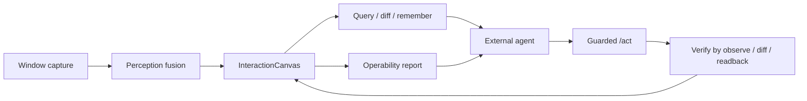

# Architecture

DeskCanvas is split into five layers.

## 1. Window and Capture

`src/windows` enumerates visible windows, captures screenshots, resolves foreground context, and normalizes window geometry.

## 2. Perception

`src/perception` merges UIA, OCR, geometric regions, DOM where available, memory, and optional VLM semantic supplements. VLM is intentionally not trusted for coordinates by itself; it annotates existing ROI/candidate evidence.

## 3. Canvas

`src/canvas` exposes the `InteractionCanvas` as the stable page model. Agents query this layer rather than driving screenshots directly.

## 4. Memory

`src/memory` stores page templates, candidate identities, evidence, visual anchors, and transition history so repeated pages become easier to recognize.

## 5. Execution

`src/execution` is a guarded adapter. It supports preflight, risk classification, bounded execution, and verification. It does not decide user intent.

